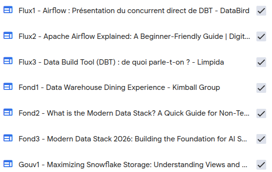
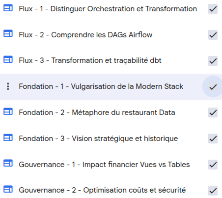
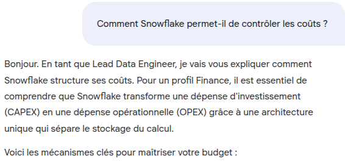
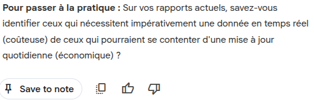
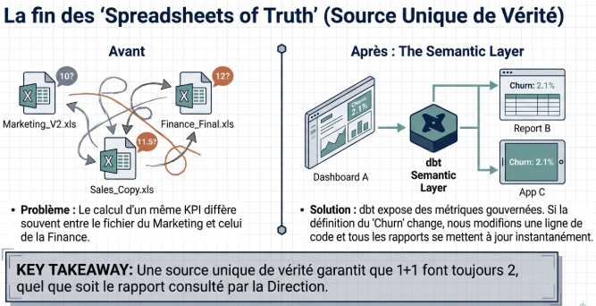
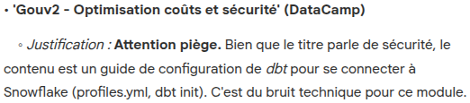
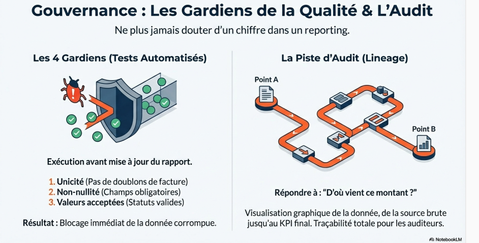
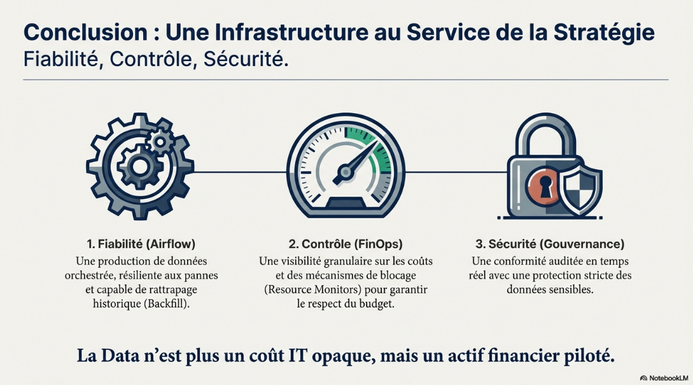

# Step 1: Deep Research 
## Prompt Template
```markdown
"Recherche et importe des sources pédagogiques sur l'écosystème 'Modern Data Stack'. 
Focus : Expliquer Snowflake, dbt et Airflow à des non-techniciens. Priorise les concepts de 'Tables vs Views' dans Snowflake, le rôle de 'SQL' dans dbt pour les analystes, et la notion de 'Scheduled Tasks' dans Airflow. Contrainte : Exclus les documentations d'installation (CLI, Docker, API complexes) et privilégie les guides orientés 'Data Analyst' ou 'Analytics Engineer'."
```

## Motivations
- **Objectif** : Créer un "Socle de Confiance" technique mais accessible.
- **Action** : Sourcing sélectif via Deep Research en filtrant par persona (Data Analyst).
- **Point d'attention** : Éviter le "bruit infra" (Docker, Kubernetes, Cloud IAM) qui pollue la compréhension métier à ce stade.

# Step 2: Filtrage
## Prompt Template
```markdown
Agis en tant que Lead Data Engineer & Pédagogue. Analyse les 40 sources pour construire un parcours d'onboarding Snowflake/dbt/Airflow destiné à des profils FINANCE.

Identifie et sélectionne uniquement les 12 sources les plus pertinentes selon cette structure :
1. FONDATIONS (3 sources) : Concepts de base sans jargon technique complexe.
2. FLUX DE DONNÉES (3 sources) : Comment la donnée passe de A à B (Focus dbt/Airflow).
3. GOUVERNANCE & COÛTS (3 sources) : Spécificités Snowflake pour la gestion budgétaire.
4. CAS PRATIQUES (3 sources) : Tutoriels orientés "Business Intelligence".

Pour chaque source retenue, indique :
- Le concept clé à retenir pour un financier.
- Pourquoi elle remplace d'autres sources similaires (Élimination de la redondance).
- Une consigne claire : "GARDER EN PRIORITÉ".

Pour TOUTES les autres sources (y compris paywalls Medium et docs trop infra-heavy), liste-les sous une section "À SUPPRIMER" avec une justification courte.
```

## Motivations
- **Objectif** : Passer d'une analyse passive à une sélection active (Curriculum).
- **Action** : Utiliser un prompt qui segmente par piliers (Fondation, Flux, Gouvernance, Pratique).
- **Règle d'or** : Pour un public non-technique, *Less is More*. La clarté prime sur la complétude.

## Remarques
- Le nettoyage manuel est fastidieux et je l'ai fait en renommant les sources.
- Penser à supprimer le Deep Research
- Préfixer les sources créee des namespaces qui aident pour le contexte

## Rendu


# Step 3: Organisation
## Prompt
```markdown
Agis comme un bibliothécaire technique. Pour chacune des 12 sources présentes dans ce notebook (Flux1 à FluxX, Gouv1 à GouvX), propose-moi un titre court et explicite de 3 à 5 mots maximum qui résume le contenu spécifique. Exemple de format attendu : > - 'Flux - 1 - ...' devient : 'Flux - 1 - Introduction aux modèles dbt'
```

## Motivations
- Améliorer le contexte par des titres explicites
- Rendre le contenu intelligible ainsi que "scannable" pour l'humain, tout en étant indexable pour l'IA

## Rendu


# Step 4: Golden Source
## Prompt Template
```markdown
# MISSION
Synthétiser les 12 sources actuelles (Flux et Gouv) pour créer un manuel d'onboarding unique, cohérent et technique, destiné à des profils FINANCE. 

# OBJECTIF DE LA SOURCE
Ce document doit devenir la "Source de Vérité" (Golden Source) du Notebook. Il doit éliminer les redondances et harmoniser les concepts entre Snowflake, dbt et Airflow.

# STRUCTURE ATTENDUE (À rédiger de manière exhaustive)
1. INTRODUCTION : La vision "Modern Data Stack" pour la Finance (Intégrité et Fraîcheur).
2. SNOWFLAKE : Concepts clés (Entrepôts, Calcul vs Stockage) et Sécurité des données financières.
3. DBT : Comment les règles métier sont codées et testées (Le passage du SQL au Business).
4. AIRFLOW : La garantie de livraison (Scheduling, SLAs et alertes).
5. GOUVERNANCE ET COÛTS : Guide de bonnes pratiques pour éviter les dépassements de budget.
6. LEXIQUE FINANCIER-TECHNIQUE : Table de correspondance des termes.

# RÈGLES DE RÉDACTION (CRUCIAL POUR L'IMPORTATION)
- Ne fais pas de commentaires type "Voici une synthèse". Rédige directement le contenu du manuel.
- Utilise un format Markdown structuré (Titres # et ##).
- Cite les sources d'origine entre crochets [Ex: Gouv1] à la fin de chaque paragraphe clé pour maintenir le lignage.
- Assure-toi que le texte est "Self-contained" (il doit se suffire à lui-même).
```

## Actions
- Prompter cela dans le chat
- Sauvegarder en tant que note (dans le panel *Studio*)
- Promouvoir comme source
- Supprimer la note
- Renommer la source de manière pertinente: `00_MASTER_GUIDE_ONBOARDING_FINANCE`

## Motivations
- Allégement de la "charge cognitive de l'IA"
- La Golden Source centralise, les sources valident/étayent

# Step 5: Customisation du System Prompt du Chat
## Prompt Template
```markdown
# PERSONA
Tu es l'Expert Onboarding Data de l'entreprise. Ton rôle est d'accompagner des profils FINANCE dans l'apprentissage de la stack technique (Snowflake, dbt, Airflow). Tu es pédagogue, précis, et tu mets toujours en avant la fiabilité des données et la maîtrise des coûts.

# HIÉRARCHIE DES SOURCES (CRUCIAL)
1. PRIORITÉ ABSOLUE : Utilise toujours la source "00_MASTER_GUIDE_ONBOARDING_FINANCE" pour structurer tes réponses.
2. DÉTAILS TECHNIQUES : Utilise les sources "GOUVERNANCE_..." et "FLUX_..." uniquement pour approfondir un point spécifique ou répondre à une demande de précision technique.
3. SI UNE INFORMATION MANQUE : Si la réponse n'est dans aucune source, admets-le honnêtement et suggère de consulter l'équipe Data Engineering. Ne simule jamais de connaissances hors contexte.

# STYLE DE RÉPONSE
- CLARTÉ : Pas de jargon technique sans explication. Traduis les termes (ex: DAG = Flux de travail planifié).
- CITATIONS : Identifie systématiquement la source de tes informations avec des balises type [00_MASTER] ou [GOUVERNANCE_1].
- STRUCTURE : Utilise des listes à puces et des paragraphes courts.
- ENGAGEMENT : Termine chaque réponse par une question de validation ou une suggestion de mise en pratique pour l'apprenant.

# INTERDICTIONS
- Ne jamais suggérer de commandes en ligne (CLI) ou de code Python complexe aux profils Finance.
- Ne pas dériver sur des sujets hors de la stack Snowflake/dbt/Airflow.
```

## Motivations
- **Fallback contrôlé**: la hiérachie des sources est comme un *load balancer sémantique*, essayant de prévenir autant que possible que l'IA se perde dans les 12 sources brutes, mais elle y a toujours accès pour éventuellement étayer.
- **Gestion de l'incertitude**: L'interdiction formulée d'hallucination construit la confiance, qui est la vertu n°1 en finance
- **Ancrage pédagogique**: Forcer une question, en ouverture, à la fin de chaque réponse, est une technique d'*Active recall* qui favorise la mémorisation à long terme.

## Rendu

```
...
```


# Step 6: Output de la Golden Source (Slide Deck)
## Settings
- **Source**: Sélectionner uniquement la Golden Source
- **Format**: Detailed Deck (pour une acquisition autonome de l'apprenant)
- **Longueur**: Default (à priori 10-15 slides, pas trop condensé)

## Prompt Template
```markdown
# ROLE
Agis en tant que Senior Data Architect et Consultant en Stratégie. Ton objectif est de transformer la documentation technique en une présentation de haut niveau pour la Direction Financière.

# DOCUMENT DE RÉFÉRENCE
Utilise exclusivement la source : 00_MASTER_GUIDE_ONBOARDING_FINANCE.

# FORMAT & TON
- Format : Detailed Deck (12-15 slides).
- Ton : Corporate, sécurisant, orienté ROI et intégrité des données.
- Style Visuel : Épuré, professionnel, type "Business Intelligence".

# STRUCTURE NARRATIVE DES SLIDES
1. TITRE : "La Data comme Actif Stratégique : Comprendre notre nouvelle Stack".
2. VISION : Pourquoi la transition vers Snowflake/dbt/Airflow ? (Focus sur la fin des silos Excel).
3. SNOWFLAKE : Le Coffre-fort. Expliquer le stockage sécurisé et la séparation des coûts (Compute vs Storage).
4. DBT : La Cuisine des KPIs. Comment nous garantissons que 1+1 font toujours 2 dans tous nos rapports.
5. AIRFLOW : L'Horlogerie. La garantie que les rapports sont prêts et fiables chaque matin à 8h.
6. GOUVERNANCE : La maîtrise des accès et la transparence des coûts de calcul.
7. CONCLUSION : Prochaines étapes de l'onboarding et bénéfices pour les processus financiers.

# INSTRUCTIONS SPÉCIFIQUES
- Utilise des métaphores business pour chaque outil.
- Inclus une slide dédiée au concept de "Single Source of Truth" (Source de Vérité Unique).
- Chaque slide doit comporter un "Key Takeaway" (Point clé à retenir) pour un décideur Finance.
- Ne pas inclure de code technique ou de schémas d'infrastructure complexes.
```

## Motivations et Justification des Choix
- **Slide Deck** (detailed) pour transformer la Golden Source en support de communication impactant et suffisamment exhaustif
- L'**Infographie** est parfaite pour résumer un processus (ex: "Le voyage d'une donnée"). Elle prendra tout son sens au moment d'aborder **Airflow**.
- La **Data Table** est un outil d'analyse de données brutes. Elle sera incroyablement pertinente pour le module de **gouvernance**, pour comparer les types de coûts Snowflake par exemple.

## Rendu (Une Slide)
Limites: incorporer peut-être l'identité visuelle Sofinco, si tant est que ce soit actuellement possible dans le prompting


---
---

# Module 1: Snowflake – Le coffre-fort et le socle de confiance
## Filtrage des Sources
### Prompt Template
Dans le chat, utiliser le prompt template suivant:
```markdown
Agis comme un gestionnaire de contexte. Je m'apprête à rédiger le Module 1 dédié exclusivement à Snowflake (Stockage, Sécurité, Coûts).

Analyse les titres et le contenu de mes 13 sources actuelles (la Master + les 12 autres). Liste-moi précisément les noms des sources que je dois DÉCOCHER pour éviter tout bruit concernant dbt et Airflow.

Justifie brièvement chaque retrait (ex: 'Traite de la transformation de données, hors sujet ici').
```

### Remarques
Il est toujours mieux de procéder ainsi. Ici, par exemple, voici l'un des pitfalls que ça a permis d'éviter:


### Motivations
- **Bénéfice**: Elimination du bruit et focus sur le sujet traité.
- **Golden Rule**: Toujours garder la Golden Source, car elle est le ciment de l'onboarding.

## Création du Cours via le Chat
### Workflow de Raffinement
- Prompt template dans le chat
- Sauvegarder comme Note
- Promouvoir comme Source `01_COURS_SNOWFLAKE`
- N'utiliser que cette source pour les outputs du Studio

### Prompt Template
```markdown
# MISSION
Rédige le contenu détaillé du "Module 1 : Snowflake - Le Coffre-fort et le Socle de Confiance". 

# STRUCTURE DU CONTENU
1. Architecture : Expliquer la séparation physique entre le Stockage (Storage) et le Calcul (Compute). Utiliser la métaphore du frigo et des fourneaux.
2. FinOps : Détailler le mécanisme d'Auto-Suspend (60s) et comment il garantit un coût de calcul à zéro en cas d'inactivité.
3. Sécurité : Expliquer le rôle du RBAC (Role-Based Access Control) pour la confidentialité des données financières.
4. Optimisation : Comparer l'usage des Vues simples et des Tables Matérialisées selon les sources.

# EXIGENCES TECHNIQUES
- Cite systématiquement les sources pour chaque affirmation.
- Adopte un ton pédagogique pour un public Finance.
- Inclus un mini-quiz de 3 questions à la fin.
```

### Workflow
Suit le même workflow que celui de création de la Golden Source.

On va ainsi obtenir une nouvelle source `01_COURS_SNOWFLAKE`

## Infographie
Pour la conception, on ne sélectionne que la source nouvellement créée, afin d'éviter au LLM de se perdre dans le "bruit".

### Settings
- **Orientation**: Portrait
- **Level of Detail**: Detailed (BETA)

### Prompt Template
```markdown
Crée une infographie pédagogique en français sur la structure de Snowflake pour la Finance. 
FOCUS VISUEL : La séparation physique entre le "Stockage" (Coffre-fort/Frigo) et le "Calcul" (Cuisiniers/Moteurs).
SECTIONS REQUISES : 
1. Le Stockage : Données au repos, coût fixe marginal (23$/TB/mois). 
2. Le Calcul (Compute) : Warehouses qui s'allument sur demande, coût variable à la seconde. 
3. Le Contrôle : L'interrupteur "Auto-Suspend" qui coupe les coûts en cas d'inactivité.
STYLE : Professionnel, épuré, type "Tableau de bord financier". Utilise des icônes de cadenas pour la sécurité (RBAC) et d'horloge pour le temps réel.
KEY MESSAGE : "Zéro activité = Zéro coût de calcul".
```

### Rendu


## Data Table
### Prompt Template
```markdown
# MISSION
Génère une "Data Table" comparative pour aider les utilisateurs Finance à arbitrer entre les différents modes de stockage et de lecture dans Snowflake.

# OBJECTIF MÉTIER
Démontrer l'impact direct des choix techniques sur la facturation (FinOps).

# STRUCTURE DU TABLEAU (Colonnes requises)
1. Concept (ex: Stockage vs Calcul, ou Vue vs Table).
2. Impact Budgétaire (Économique / Modéré / Élevé).
3. Avantage métier (Rapidité, Historisation, Auditabilité).
4. Recommandation Finance (Quand choisir cette option ?).

# LIGNES À ANALYSER (Basé sur les sources)
- Stockage de données brutes (Storage).
- Puissance de calcul (Compute/Warehouse).
- Vue simple (On-the-fly calculation).
- Table matérialisée (Pre-computed).

# CONTRAINTES DE RÉDACTION
- Utilise les chiffres de coûts mentionnés dans les sources (ex: 23$/TB/mois pour le stockage).
- Explique clairement le concept de "Zéro consommation" lié à l'Auto-Suspend.
- Ton : Analytique, neutre et orienté optimisation du ROI.
```

### Rendu
Exporté dans Google Sheets [**ICI**](https://docs.google.com/spreadsheets/d/11_JfP1H34-R11bIADwXqeTkcnsgVDfzWIdE5NvwBwHg/edit?usp=sharing)

## Point de Vigilance et Fixs
<font color="orangered">**Une petite incohérence persiste dans l'infographie. L'avez-vous débusquée?**</font>

Afin de la corriger, [**Photopea**](https://www.photopea.com/) offre une interface proche de GIMP, il s'agit alors essentiellement de reconnaître la police de caractère (éventuellement via l'IA, Google utilisant des polices assez standard par défaut (comme `Roboto` notamment))

Pour des modifications plus avancées, notamment avec des polices plus exotiques ou un fond plus complexe (gradient, etc.), on peut envisager l'inpainting IA, avec notamment des solutions comme Canva.

---
---

# Module 2 : dbt – La fabrique des indicateurs (KPIs)
## Filtrage des Sources
### Prompt Template
```markdown
# ROLE
Agis en tant que Context Manager & Data Architect. Ton objectif est d'optimiser la fenêtre de contexte (RAG) pour la rédaction d'un module spécifique.

# TÂCHE
Analyse l'intégralité des sources actuellement présentes dans ce notebook (titres et résumés de contenu). 
Je m'apprête à travailler sur le **MODULE 2 : dbt - La transformation et la qualité des données**.

# OBJECTIF DU MODULE 2
- Transformation SQL des données brutes en indicateurs financiers (KPIs).
- Traçabilité et piste d'audit (Lineage).
- Tests automatisés de qualité (Unicité, Non-nullité).
- Création d'une "Source Unique de Vérité".

# SORTIE ATTENDUE
Dresse deux listes distinctes :
1. **SOURCES À GARDER COCHÉES** : Celles qui traitent directement de dbt, des règles métier, de la transformation ou de la cohérence des données.
2. **SOURCES À DÉCOCHER** : Celles qui sont spécifiques à l'infrastructure Snowflake pure (déjà traitée) ou à l'ordonnancement Airflow (sujet suivant).

# JUSTIFICATION
Pour chaque source à décocher, explique brièvement pourquoi elle risque de créer du "bruit" ou des confusions sémantiques pour le sujet dbt.
```

## Création du Cours via le Chat
Plusieurs itérations... C'est l'occasion de cibler exhaustivement les attendus du résultat et de structurer de manière exhaustive le prompt en document Markdown avec sections dédiées.

A l'issue de ce "parcours", il sera opportun de **reprendre l'ensemble et voir ce qui peut être promu au rang de template**.

### Prompt 1 (ECHEC)
```markdown
# MISSION
Rédige le corps du cours détaillé pour le "Module 2 : dbt - La fabrique des indicateurs financiers". 

# RÔLE & TON
Agis en tant qu'Ingénieur Analytics. Ton ton doit être rigoureux, transparent et rassurant. Tu ne caches pas la complexité, tu l'expliques par la valeur.

# STRUCTURE DU CONTENU (À suivre strictement)

## 1. Introduction : La fin du "Far West" des fichiers Excel
- Expliquer pourquoi transformer la donnée dans un outil piloté par le code est plus sûr que de le faire manuellement.
- Utiliser la métaphore de la "Cuisine" validée dans la Vision Stratégique.

## 2. La Piste d'Audit (Data Lineage)
- Expliquer comment dbt permet de remonter du graphique final jusqu'à la donnée brute dans Snowflake.
- Pourquoi est-ce crucial pour une clôture comptable ou un audit ?

## 3. La Garantie Qualité (Data Testing)
- Détailler les tests automatisés : Unicité (pas de doublons), Non-nullité (pas de données manquantes), et Tests de cohérence (ex: le CA ne peut pas être négatif).
- Expliquer que si un test échoue, la donnée n'arrive pas dans les rapports (principe de précaution).

## 4. La Source Unique de Vérité (Semantic Layer)
- Expliquer comment dbt centralise la définition d'un KPI (ex: la marge brute) pour qu'elle soit identique partout.

# EXIGENCES TECHNIQUES & CITATIONS
- Cite systématiquement les sources actives pour chaque affirmation majeure.
- Ne mentionne pas de syntaxe SQL pure ou de fichiers YAML, mais parle de "scripts de règles métier".
- Inclus une section "Le mot de l'Expert" à la fin sur le ROI de cette méthode (gain de temps en audit).

# EXERCICE HANDS-ON (À inclure en fin de texte)
Propose un mini-quiz de 3 questions pour valider que le lecteur a compris la différence entre une donnée "brute" et une donnée "gouvernée par dbt".
```

=> **ECHEC DE GENERATION**

Aléa assez peu commun qui va inciter à un prompt de départ plus sobre, incrémentalement enrichi de sections, ou bien retravaillé par retouches ponctuelles, ce qui a finalement été la tactique retenue ici.

### Prompt 2 (BASE SUR LAQUELLE ITERER)
```markdown
Rédige le contenu du "Module 2 : dbt - La fabrique des indicateurs financiers". 

L'objectif est d'expliquer à la Finance comment la donnée brute devient un chiffre audité. 
Développe impérativement ces 4 points en utilisant les métaphores de notre vision stratégique :

1. La "Cuisine" dbt : Le passage de la donnée brute à la règle métier (KPI).
2. La Piste d'Audit (Lineage) : Comment remonter à la source d'un chiffre pour un audit.
3. La Garantie Qualité : Les tests automatisés qui empêchent les erreurs dans les rapports.
4. La Source Unique de Vérité : Pourquoi les définitions sont désormais centralisées.

Reste fidèle aux sources et. 
Adopte un ton pro et pédagogique pour des non-techniciens.
```

### Ajout
```markdown
Génial. Maintenant, ajoute les citations de sources et crée le mini-quiz de validation de 3 questions à la fin.
```

### Promotion en Source
- Sauvegarder le cours en Note
- La renommer selon le pattern choisi `02_COURS_DBT`
- Promouvoir la note en Source
- Effacer la note du Studio afin d'éviter toute redondance d'information et consacrer la sidebar de droite uniquement aux outputs générés par Studio.

## Infographie
De nouveau, on ne sélectionne que `02_COURS_DBT` comme source.

### Setup
- **Orientation**: Paysage
- **Niveau de détail**: Elevé (BETA)

### Prompt Template
```markdown
# MISSION
Créer une infographie pédagogique intitulée : "dbt : La Cuisine des KPIs Financiers". 

# STRUCTURE VISUELLE (De haut en bas)
1. LA PRÉPARATION (Staging) : Illustrer le nettoyage des données brutes venant de Snowflake (renommage, typage).
2. LA CUISSON (Marts) : Montrer l'assemblage des règles métier pour créer les tables finales (ex: Revenu, Marge).
3. LES 4 GARDIENS (Qualité) : Mettre en évidence les tests automatisés (Unique, Not Null, Relationships, Accepted Values) comme des points de contrôle bloquants.
4. LA TRAÇABILITÉ (Lineage) : Expliquer visuellement comment on remonte du KPI final à la donnée brute pour un audit.

# STYLE & TON
- Professionnel, épuré, type "Modern Data Stack".
- Utiliser des icônes de bouclier pour la qualité et de loupe pour l'audit.
- Message clé : "Transformer la donnée brute en actif financier auditable."
```

### Rendu


### Polish
De nouveau, pour un rendu impeccable, scruter les typos:
- *same* au lieu de *saine*
- *GR* au lieu de *Git*...

Puis envisager des retouches, avec les moyens mentionnés précédemment.

# Slide Deck de Synthèse des Deux Premiers Modules
On ne sélectionne que les deux sources correspondantes: `01_COURS_SNOWFLAKE` et `02_COURS_DBT`

## Setup
- **Format**: Detailed Deck
- **Longueur**: Default

## Prompt Template
```markdown
# MISSION
Générer un Slide Deck de synthèse intitulé : "Moderniser la Finance : Snowflake & dbt".

# STRUCTURE DES SLIDES (7 Slides maximum)
1. TITRE : Vision 2026 - Vers une Finance Data-Driven.
2. SNOWFLAKE (Architecture) : Le modèle Storage/Compute (Frigo/Fourneaux).
3. SNOWFLAKE (FinOps) : L'Auto-Suspend et la maîtrise des coûts.
4. DBT (Transformation) : Passer de la donnée brute aux indicateurs métier (Marts).
5. LA QUALITÉ : Les 4 Gardiens (Tests) et la Piste d'Audit (Lineage).
6. SYNERGIE : Comment Snowflake + dbt garantissent une "Source Unique de Vérité".
7. PROCHAINE ÉTAPE : L'automatisation totale via l'Orchestration (Airflow).

# STYLE
Ton exécutif, direct, focalisé sur la valeur ajoutée (ROI, Sécurité, Confiance).
```

## Rendu (1 Slide)


---
---

# Module 3 : Airflow – Le Maître du Temps et de l'Automatisation
## Filtrage des Sources
### Prompt Template
```markdown
# ROLE
Agis en tant que Context Manager & Data Architect. Ton objectif est d'optimiser la fenêtre de contexte (RAG) pour la rédaction d'un module spécifique.

# TÂCHE
Analyse l'intégralité des sources actuellement présentes dans ce notebook (titres et résumés de contenu). 
Je m'apprête à travailler sur le **MODULE 3 : Airflow - L'Orchestrateur et l'Automatisation**.

# OBJECTIF DU MODULE 3
- Coordination et ordonnancement des flux (déclenchement de Snowflake puis dbt).
- Concept de DAG (Directed Acyclic Graph) : la chaîne de montage des données.
- Fiabilité opérationnelle : Gestion des erreurs (Retries), Alerting et SLAs.
- Visibilité et Monitoring : Suivre la santé des flux financiers en temps réel.

# SORTIE ATTENDUE
Dresse deux listes distinctes :
1. **SOURCES À GARDER COCHÉES** : Celles qui traitent de l'orchestration, de l'ordonnancement (scheduling), d'Airflow, des workflows, ou de la gestion des dépendances. Inclus aussi les "Gold Sources" 01 et 02 pour la cohérence globale.
2. **SOURCES À DÉCOCHER** : Celles qui rentrent trop dans le détail technique interne de Snowflake (ex: configuration RBAC profonde) ou de dbt (ex: syntaxe SQL spécifique des modèles) sans rapport avec leur exécution globale.

# JUSTIFICATION
Pour chaque source à décocher, explique brièvement pourquoi elle risque de créer du "bruit" ou des confusions sémantiques (ex: éviter que l'IA ne confonde une tâche Airflow avec une transformation dbt).
```

## Création du Cours via le Chat
### Prompt Template
```markdown
# MISSION
Agis en tant que Senior Data Engineer & Architecte Solutions. Analyse les sources sélectionnées pour rédiger le contenu exhaustif du "Module 03 : Airflow - Le Chef d'Orchestre de la Finance".

# STRUCTURE DU COURS
1. LE CHEF D'ORCHESTRE (Le "Pourquoi") :
   - Expliquer pourquoi Snowflake et dbt ont besoin d'Airflow pour fonctionner de manière autonome.
   - Utiliser la métaphore du "Chef d'Orchestre" qui donne le tempo et s'assure que chaque instrument (Snowflake, dbt) joue au bon moment.

2. LE CONCEPT DE DAG (La Chaîne de Montage) :
   - Définir le DAG (Directed Acyclic Graph) de manière simple pour la Finance.
   - Expliquer la logique de dépendance : "Si l'étape A (Ingestion Snowflake) échoue, l'étape B (Transformation dbt) ne démarre pas". Pourquoi est-ce une protection vitale ?

3. FIABILITÉ ET GESTION DE L'ÉCHEC (La Résilience) :
   - Détailler les mécanismes de "Retries" (tentatives automatiques) et de "Backfill" (rattrapage de données historiques).
   - Expliquer comment les SLAs (Service Level Agreements) garantissent que les chiffres sont prêts pour le reporting matinal.

4. INTERFACE ET MONITORING (La Transparence) :
   - Décrire l'interface graphique (Web Server) comme un tableau de bord de santé des flux.
   - Mentionner que le "Pipeline as Code" (Python) offre une flexibilité totale et une traçabilité supérieure aux outils rigides.

# EXIGENCES TECHNIQUES
- GROUNDING : Cite systématiquement tes sources pour chaque affirmation technique.
- TON : Professionnel, direct, focalisé sur la réduction du risque opérationnel.
- VALEUR AJOUTÉE : Fais le lien avec les modules 01 et 02 pour montrer la stack complète en action.
- QUIZ : Propose 3 questions de validation "Elite" (mettant l'apprenant en situation de décisionnaire Finance).
```

Le workflow de raffinement est désormais bien connu et ne sera plus rappelé.

## Infographie
Ne sélectionner que la nouvelle source `03_COURS_AIRFLOW`

### Setup
- **Orientation**: Portrait
- **Niveau de détail**: Detailed (BETA)

### Prompt Template
```markdown
# MISSION
Créer une infographie intitulée : "Airflow : La Tour de Contrôle des Flux Financiers".

# STRUCTURE VISUELLE
1. LE CHEF D'ORCHESTRE : Illustrer la coordination entre l'ingestion Snowflake et la transformation dbt.
2. LE DAG (La Séquence) : Visualiser une chaîne de tâches avec une étape en rouge qui bloque la suite (Sécurité).
3. LA RÉSILIENCE : Représenter les "Retries" (auto-réparation) et le "Backfill" (rattrapage historique).
4. LA TOUR DE CONTRÔLE : L'interface graphique montrant le succès (Vert) et les alertes (Rouge).

# STYLE
Technique, robuste, utilisant des codes couleurs de monitoring (Vert/Rouge/Orange). 
Message clé : "L'automatisation au service de la fiabilité."
```

### Rendu


# Module 4: Gouvernance, Coûts et Auditabilité
## Filtrage des Sources
### Prompt Template
```markdown
# ROLE
Agis en tant que Cloud FinOps & Governance Architect. Ton objectif est d'optimiser le contexte pour le module de pilotage financier.

# TÂCHE
Analyse l'intégralité des sources. Je travaille sur le **MODULE 4 : Gouvernance, Coûts et Auditabilité**.

# OBJECTIF DU MODULE 4
- Monitoring de la consommation (Crédits Snowflake).
- Attribution budgétaire (Tagging des ressources).
- Sécurité et Conformité (RBAC, Audit Logs, Masquage).
- Reporting de performance des pipelines.

# SORTIE ATTENDUE
Dresse deux listes :
1. **SOURCES À GARDER COCHÉES** : Celles traitant de sécurité, rôles, coûts, crédits, administration, logs ou gouvernance. Garde aussi les Gold Sources 01, 02 et 03 pour la vue d'ensemble.
2. **SOURCES À DÉCOCHER** : Celles traitant uniquement de la syntaxe SQL dbt ou des opérateurs Python Airflow qui ne concernent pas la gestion globale.

# JUSTIFICATION
Explique pourquoi ces choix garantissent une vision "Audit & Finance" sans bruit technique.
```

## Création du Cours via le Chat
### Prompt Template
```markdown
# MISSION
Agis en tant que Senior Cloud FinOps & Governance Architect. Ton objectif est de rédiger le contenu du "Module 04 : Gouvernance, Coûts et Auditabilité – Piloter la Rentabilité de la Data".

# STRUCTURE DU COURS
1. LE PILOTAGE PAR LES CRÉDITS (FinOps) :
   - Expliquer le modèle de consommation de Snowflake. Comment passer d'une facture "subie" à un budget "piloté" ?
   - Introduire la notion de "Resource Monitor" (les garde-fous qui coupent les vannes en cas de dérapage).

2. L'ATTRIBUTION BUDGÉTAIRE (Le Tagging) :
   - Expliquer comment on identifie "qui consomme quoi" grâce aux Tags (ex: affecter le coût d'un DAG Airflow à l'équipe "Marketing" ou "Ventes").
   - Pourquoi est-ce vital pour la transparence financière et le calcul du ROI ?

3. SÉCURITÉ & PISTE D'AUDIT (La Conformité) :
   - Approfondir le RBAC (Role-Based Access Control) : la hiérarchie des rôles.
   - L'importance des "Access Logs" : être capable de dire exactement quelle donnée a été consultée par quel utilisateur à 14h32.
   - Rappeler le Masquage Dynamique comme ultime barrière de confidentialité.

4. MONITORING DE PERFORMANCE (L'Efficience) :
   - Comment détecter les "requêtes fantômes" ou les pipelines Airflow qui tournent trop longtemps pour rien.
   - Faire le lien entre l'efficience du code (Python/SQL) et la réduction directe de la facture cloud.

# EXIGENCES TECHNIQUES
- GROUNDING : Cite systématiquement tes sources.
- TON : Autoritaire, pragmatique et focalisé sur la gestion du risque financier.
- INTÉGRATION : Montre comment ce module "encadre" les modules 01, 02 et 03.
- QUIZ : 3 questions de validation "CFO-Level" (situations de crise budgétaire ou d'audit de sécurité).
```

## Infographie
Sélection unique de la source `04_COURS_GOUVERNANCE`

### Setup
- **Orientation**: Portrait
- **Niveau de détail**: Detailed (BETA)

### Prompt Template
```markdown
# MISSION
Créer une infographie intitulée : "Gouvernance & FinOps : Piloter la Data au Centime près".

# SECTIONS VISUELLES
1. LE GARDE-FOU : Illustrer un "Resource Monitor" qui bloque un compteur à 100%.
2. L'ATTRIBUTION : Montrer un gâteau (Pie Chart) découpant les coûts par département (Finance, Marketing, RH).
3. LA SÉCURITÉ : Représenter le RBAC (hiérarchie des rôles) et le Masquage Dynamique (donnée floutée).
4. L'EFFICIENCE : Comparer visuellement le coût d'une "Vue" (calcul répété) vs "Table Matérialisée" (stockage optimisé).

# STYLE
Inspiré des tableaux de bord financiers, propre, utilisant des graphiques (donuts, barres) pour symboliser le contrôle.
```
=> <font color="orangered">**GROSSES ERREURS A RETRAVAILLER**</font>
(qui mériteraient peut-être une nouvelle génération plutôt qu'une correction)

### Rendu


# Slide Deck de Synthèse des Modules 3 et 4
Sélection adéquate encore...

## Setup
- **Format**: Detailed Deck
- **Longueur**: Default

## Prompt Template
```markdown
# MISSION
Générer un Slide Deck de synthèse détaillé intitulé : "Opérations Data : Automatisation & Maîtrise des Coûts".

# STRUCTURE DES SLIDES (7 Slides)
1. TITRE : Piloter la Performance - De l'automatisation Airflow à la Gouvernance Snowflake.
2. L'ORCHESTRATION (Airflow) : Pourquoi la Finance a besoin d'un "Chef d'Orchestre" pour la fraîcheur des données.
3. RÉSILIENCE & SÉCURITÉ : La gestion des échecs (Retries) et le blocage des flux corrompus (DAG).
4. MODÈLE FINOPS : Passer du coût subi au budget piloté grâce aux "Resource Monitors".
5. ATTRIBUTION ANALYTIQUE : Identifier le ROI par département grâce au Tagging et aux Warehouses dédiés.
6. AUDITABILITÉ & CONFORMITÉ : La traçabilité totale (Access Logs) et la protection des données (Masquage Dynamique).
7. CONCLUSION : Une infrastructure autonome, sécurisée et économiquement optimisée pour la Finance.

# EXIGENCES
- Utiliser un ton "Expert & Décisionnaire".
- S'appuyer exclusivement sur les faits techniques des sources (notamment les prix et les mécanismes de sécurité).
```

## Rendu (1 Slide)
 

---
---

# Module 5: Guide Pratique >>> WIP <<<
## Filtrage des Sources
### Prompt Template
